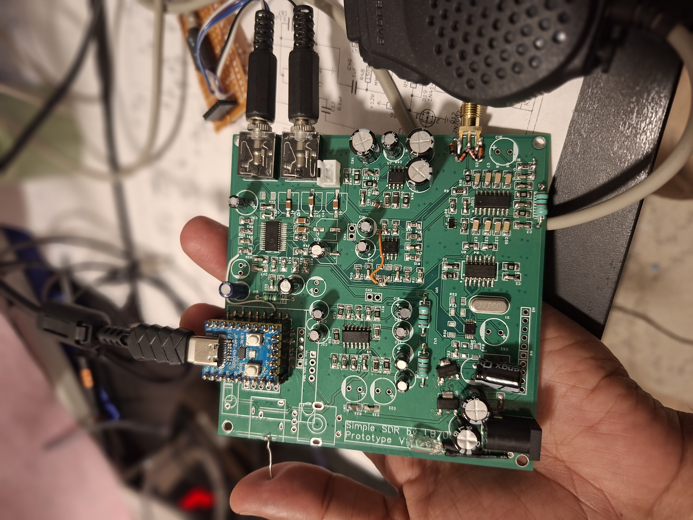

# LMR-SDR — RP2040 QSD/QSE Transceiver Firmware

Firmware for a SoftRock-style quadrature sampling detector (QSD) / quadrature
sampling exciter (QSE) HF transceiver, built around an RP2040, a WM8731 audio
codec, and a Si5351A clock generator. Presents to the host PC as a USB Audio
Class 2 (UAC2) stereo sound card carrying I/Q audio, plus a USB CDC serial
port for Kenwood-style CAT control (compatible with PowerSDR, hamlib, and
similar software).



## Hardware overview

- **RP2040** — main controller, dual-core (see "Core split" below)
- **Si5351A** — LO generator; CLK0 → external 74LVC74 (÷4) → FST3253 quadrature
  switch, driving the shared QSD (RX) / QSE (TX) analog front end
- **WM8731** — stereo audio codec; Line In carries the QSD's I/Q baseband
  output, Line Out feeds the QSE, headphone output drives a local speaker
- Manual PTT button, T/R switching line, and RTS-based PTT are all supported
  and OR-combined (any source can key the rig)

## Firmware features

- USB Audio Class 2 stereo I/Q streaming (RX) and stereo audio out (TX)
- USB CDC CAT control: `ID;`, `FA;`/`FAxxxxxxxxxxx;`, `MD;`, `PS;`, `AI;`,
  `TX;`, `RX;` — see `cat_app.c` for the full command ladder
- A `!`-prefixed human debug console sharing the same CDC port (see below)
- Optional dual-core split (`dual_core_config.h`): USB/audio isolated on
  Core1, all I2C control-plane traffic (Si5351, WM8731) and CAT parsing on
  Core0, so a slow I2C transaction can never stall audio streaming
- **Automatic RX gain calibration** (`rx_gain_cal.*`) — sweeps the WM8731's
  line-in PGA at boot to find the highest gain that stays under a configured
  headroom margin, maximizing weak-signal SNR without needing a PC or manual
  tuning. Includes a continuous clip counter for field verification.
- **Optional frequency-dependent I/Q correction** (`iq_correction.*`) — a
  calibrated FIR filter that corrects phase/amplitude imbalance that grows
  with baseband frequency (beyond what a simple, frequency-independent
  gain/phase tweak — like the one built into PowerSDR/HDSDR's I/Q
  calibration wizard — can fix). **Not enabled by default** — see
  "I/Q correction" below before turning this on.

## Debug console

The CDC port carries CAT traffic by default (no banner, so CAT software
sees a clean port). Prefix any of the following with `!` to reach the
human debug console instead:

| Key | Action |
|-----|--------|
| `?` / `h` | Status: TX/RX buffer state, VFO/mode/PTT, underrun/overrun/clip counters, RX gain |
| `v` | Toggle verbose debug output |
| `m` | Toggle DAC mute |
| `u` | Reset underrun/overrun/clip counters |
| `g` | Re-run the automatic RX gain calibration sweep |

Enable `!v` before a `!g` sweep if you want to watch the gain search
happen step by step.

## Building

Requires the [Raspberry Pi Pico SDK](https://github.com/raspberrypi/pico-sdk)
and [TinyUSB](https://github.com/hathach/tinyusb) (usually vendored via the
Pico SDK). Standard Pico SDK CMake workflow:

```sh
mkdir build && cd build
cmake -DPICO_BOARD=pico ..
make -j4
```

Flash the resulting `.uf2` to the RP2040 in BOOTSEL mode.

## RX gain calibration

Runs automatically at boot once the WM8731/DMA capture is active. Watch it
over the CDC debug console with `!v` enabled — you'll see one line per gain
step, ending with the settled value. Re-run any time (e.g. after moving the
antenna) with `!g`. See `rx_gain_cal_integration.md` for the full design
rationale, including the headroom-margin tuning knob and the full-scale
constant that must match your I2S bit alignment.

## I/Q correction (optional, off by default)

`iq_correction.c`/`iq_correction.h` apply a calibrated FIR filter to correct
phase/amplitude imbalance that varies across the audio passband — useful if
your analog front end (QSD switch, anti-alias RC filters, op-amp tolerances)
shows measurably worse image rejection at the edges of your passband than at
its center.

**The coefficients in `iq_fir_coeffs.h` are illustrative placeholders, not a
measured correction for any particular hardware.** Do not enable this
without first running `iq_calibration.py` against real measurements of your
own board (see the script's header comment for the calibration procedure),
or you will apply a "correction" tuned to fictitious data.

Before building this into your firmware, it's worth first trying your SDR
host software's own I/Q calibration wizard (PowerSDR/HDSDR both have one) —
centered near the middle of your working passband. That corrects a
frequency-independent imbalance well; if your residual error after that is
small enough for your use case, you may not need the firmware-side
correction at all. See `rx_gain_cal_integration.md` and the project's
conversation history / commit messages for the fuller design discussion.

## Attribution & License

See `LICENSE.txt`. This project's own code is MIT-licensed, credited to its
original authors (2020–2026). **`i2s.pio` is a separate case**: it's adapted
from Daniel Collins' GPLv3-licensed `rp2040_i2s_example`, and remains GPLv3
— this has real implications for how you may distribute compiled firmware
built from this repository. Read the notice at the top of `LICENSE.txt`
before distributing binaries.

## Known limitations / things worth verifying on your own build

- `RX_SAMPLE_FULL_SCALE` in `rx_gain_cal.c` assumes a specific I2S bit
  alignment (24-bit ADC data left-justified in a 32-bit slot, per this
  project's `i2s.pio` + WM8731 `IWL_32BIT` configuration). If you change
  the WM8731 word-length setting or the PIO program, re-verify this
  constant — see the comment in `rx_gain_cal.h`.
- The manual PTT pin, T/R pin, and other board-specific GPIO assignments
  live in `cat_app.h` — edit these to match your wiring before building.
- The Si5351 crystal frequency and PPB correction (`si5351.h`) are specific
  to your breakout board's crystal; verify against your board's marking.
